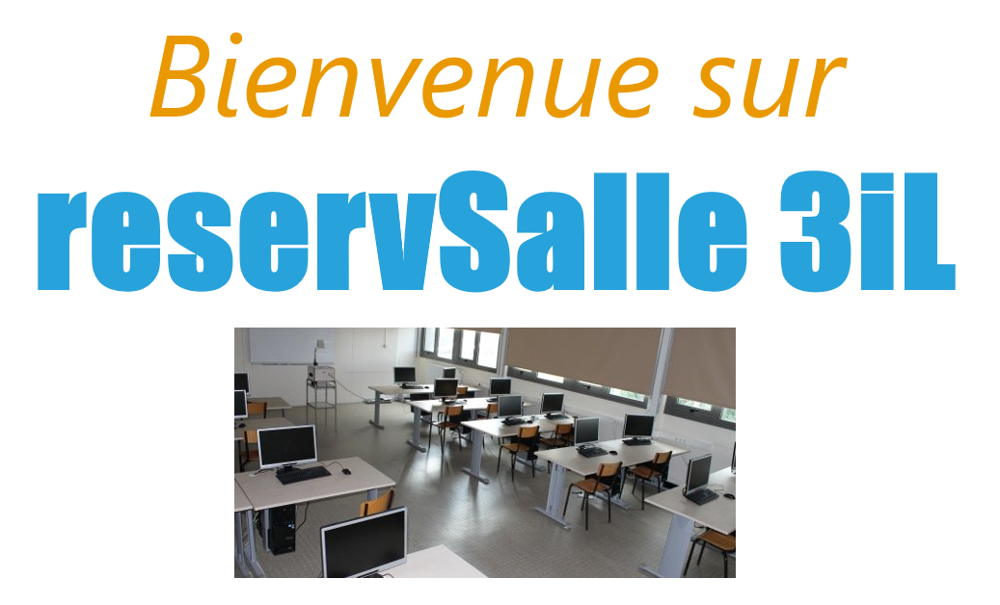

# reservSalle

Projet Web

Site de réservation de salle avec plusieurs niveaux de sécurité :
- SESSION
- Tokens CSRF
- Clavier numérique de connexion encodé (similaire aux applis banquaire)

et utilisant des requêtes Ajax

Le tout reprenant un modèle MVC

